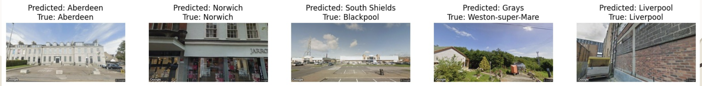

# Restricted Domain Street View Geolocator CLIP (Restricted GeoCLIP)

For this project, we aim to build a model that can take an image, particularly from Google Street View, and predict the location in which it was taken. Being able to identify location from images can be very useful for applications that use geotagging, navigation, for emergency services, or for investigative work such as finding missing persons or criminals. We based this off of a pre-existing model, and our primary contribution was implementing OpenAI's CLIP model to pair image data with text embeddings for higher accuracy on new test data. 

Our secondary contribution was to include image data of other geographic regions not a part of the original analysis (the UK in particular). We successfully gathered about 117,000 new images with corresponding text labellings, that accurately described an identifying city, state and country, across both the US and the UK. In turn, we built a classification model for UK data that was able to achieve 27% accuracy with a low average distance of predicted-to-actual location of 131 km.

**Top 150 Cities Model Prediction Example:**

Google Drive folder containing our model dumps in PyTorch:
https://drive.google.com/drive/folders/13P5BeKpfzUh37nUUONpCe7HrMD72qtTg?usp=sharing

Presentation Video:
https://youtu.be/Ftjf8YQp5U8?si=L7qb6U7iHKpOe04v

Data: 
https://drive.google.com/drive/folders/1zTK_v1J5NryVCq6GqQ7abqnLK6Rypz4R?usp=sharing

